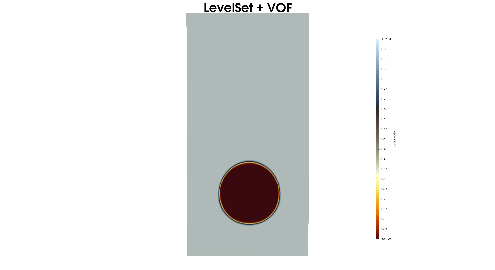

# Level-Set and VOF Hybrid Method in OpenFOAM


## Overview
This repository contains the implementation of a **hybrid Level-Set and Volume of Fluid (VOF) method** for interface tracking in OpenFOAM. The hybrid approach combines the high interface precision of the Level-Set method with the mass conservation benefits of the VOF method, enabling robust and accurate multiphase flow simulations. 

The solver is designed for applications such as:
- Free-surface flows
- Droplet dynamics
- Multiphase interactions
- Interface capturing in complex geometries



## Features
- **Hybrid Level-Set and VOF Approach**: Improved interface tracking by leveraging both methods.
- **Mass Conservation**: Retains the advantages of VOF for global mass conservation.
- **Sharp Interface Representation**: Enhanced by the Level-Set method's ability to track fine interface details.
- **Robust Solver**: Built on the OpenFOAM framework for extensibility and flexibility.
- **Customization Options**: Adjustable parameters for interface smoothing, reinitialization, and flux correction.

## Installation
 **Clone the Repository**:
   ```bash
   git clone https://github.com/cloner0110/LevelSet-VOF.git
   cd LevelSet-VOF/src && wmake
   ```


## Prerequisites
- **OpenFOAM** (v2312)

## Methodology
This implementation integrates:
1. **Level-Set Method**: Solves for a signed distance function to track interfaces.
2. **VOF Method**: Utilizes a volume fraction field for mass conservation.
3. **Hybrid Correction**:
   - Reinitialization of the Level-Set field.
   - Flux corrections to ensure interface consistency.


## Contact
For questions, feedback, or collaboration inquiries, please reach out:
- **Email**: [amirhossein.taran@ucdconnect.ie](mailto:amirhossein.taran@ucdconnect.ie)
- **GitHub Issues**: [Report an Issue](https://github.com/cloner0110/LevelSet-VOF/issues)


## License
This project is licensed under the [MIT License](LICENSE). You are free to use, modify, and distribute the code with proper attribution.


